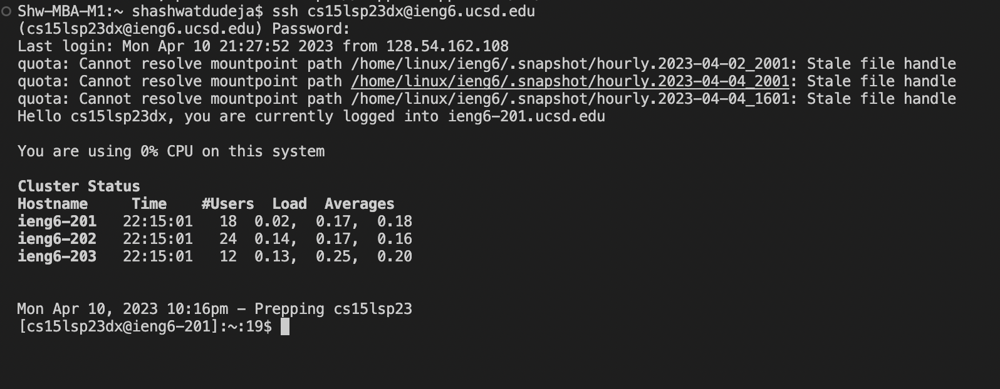

## Lab Report 1: Remote Access and FileSystem

---

* Installing VScode
* Remotely Connecting
* Trying Some Commands

---

> **Installing VScode**

[Install Visual Studio Code](https://code.visualstudio.com/)

Go to site and install version of visual studio for your operating system

For mac, it should look like this after installing and launching

---

> **Remotely Connecting**

After opening VSCode, open a new terminal from either the menu bar on the top of the screen(Terminal -> New Terminal)
or using control+shift+backwards quotation mark

In order to remotely connect to your account, we use ssh standing for secure shell.

Type in "ssh --account-name--"
In our case, it would look something like "ssh csxxxxx@ieng6.ucsd.edu"

If you are logging in for the first time, you will see a message saying "the authenticity of host xxxx cannot be estabilished.....
are you sure you want to continue connecting(yes/no/fingerprint)?"
Type in yes and proceed to enter your password.

---

> **Trying some commands**

You've successfully remotely connected to another computer.
You can try using basic commands like cd, pwd, ls, mkdir and experimenting or looking around the directory and the files

You can cmd+d or typing "exit" when you're done to log out of the secure shell
