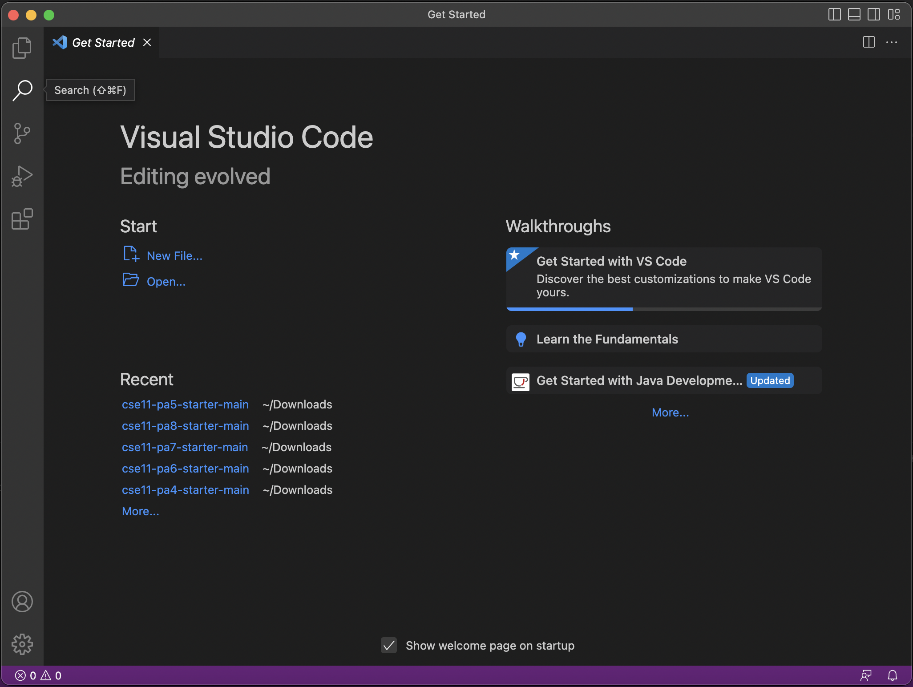

## Lab Report 1: Remote Access and FileSystem

---

* Installing VScode
* Remotely Connecting
* Trying Some Commands

---

> **Installing VScode**

[Install Visual Studio Code](https://code.visualstudio.com/)

Go to site and install version of visual studio for your operating system

For mac, it should look like this after installing and launching

---

> **Remotely Connecting**

