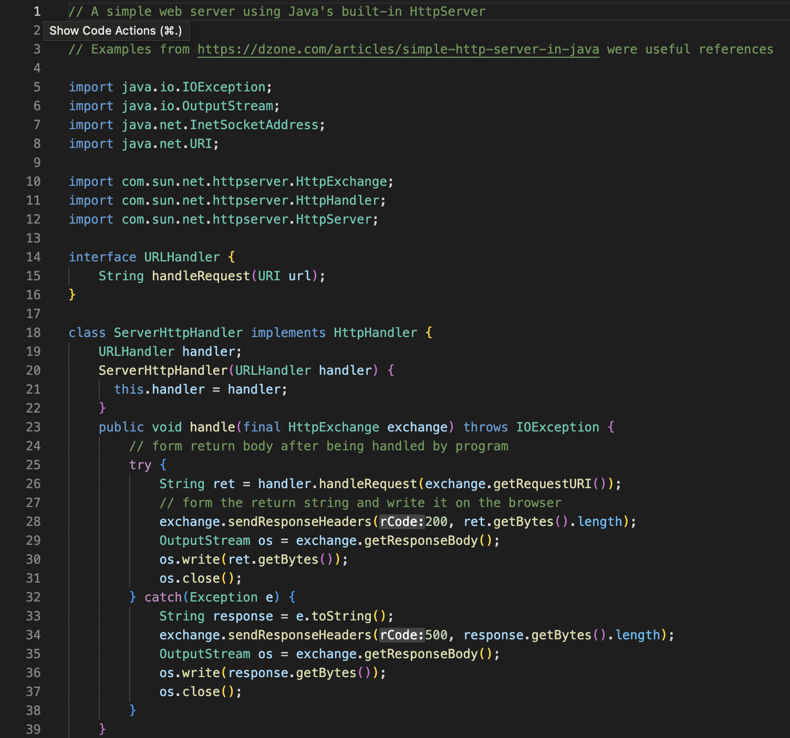
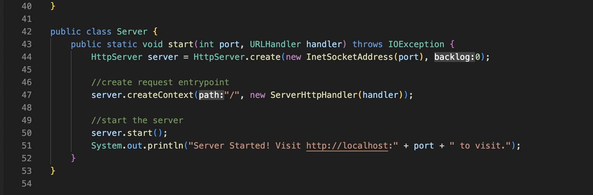
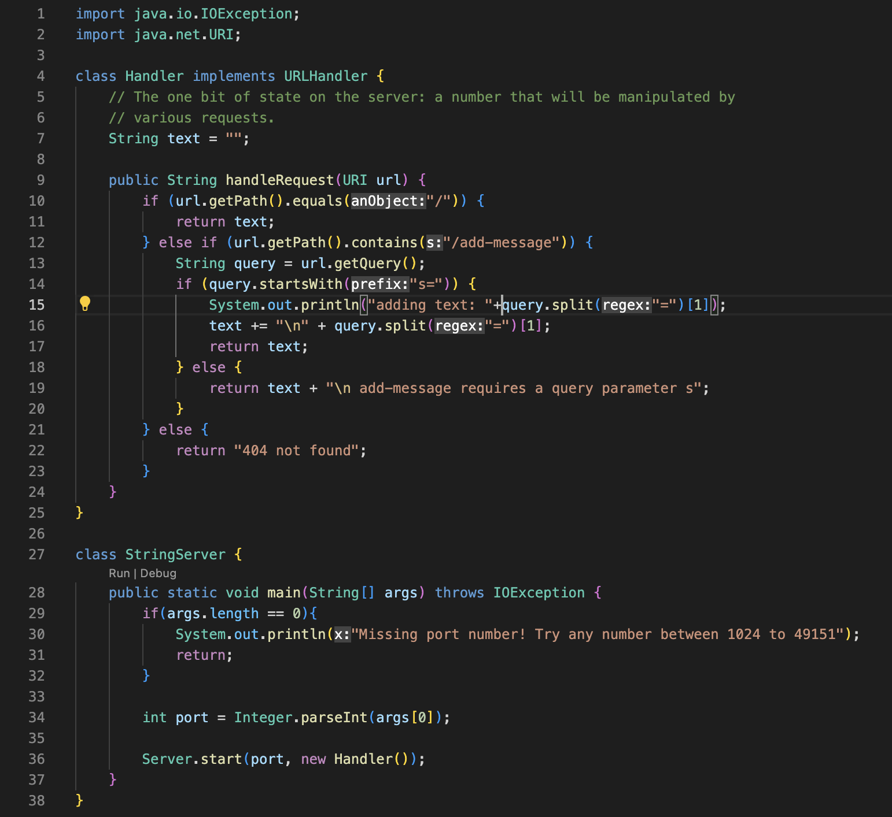
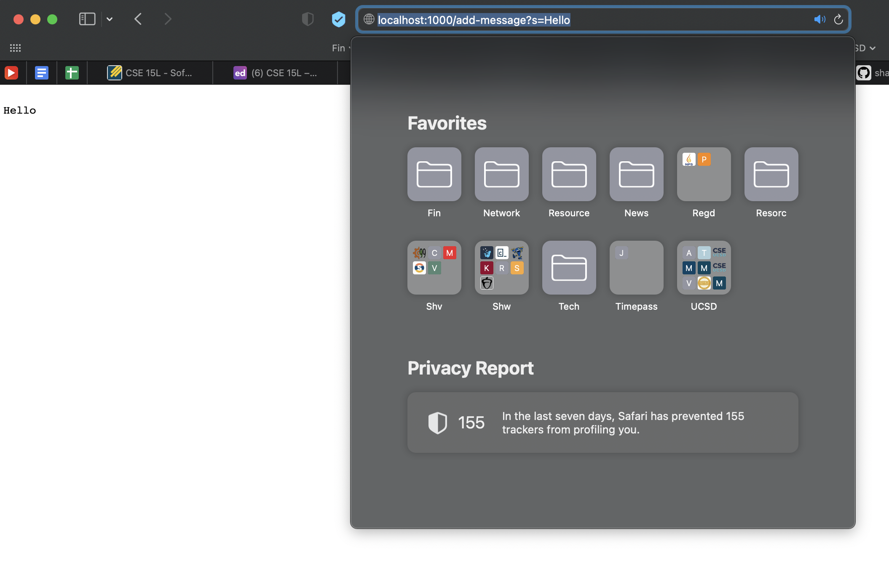
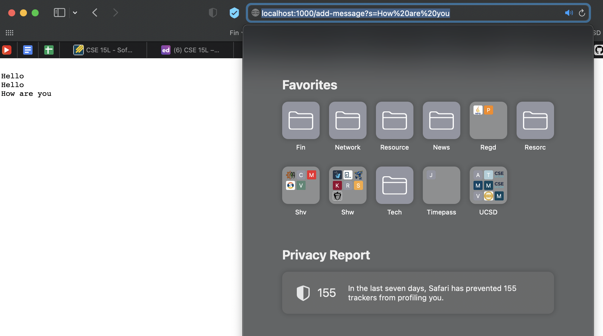

## Lab Report 2: Servers and Bugs

---

* Part 1

> **Web Server: String Server**

Code:

add-message requests:

The code starts in the StringServer class in the main method from where it creates an instance of the Server class from the Server.java file. An instance of the Handler class is sent to the server so that the Handler class we wrote in the StringServer.java file is used to handle requests such as "/add-message?s=xxx". The class returns the string text variable which is what is shown on the site
When the /add-message request is sent, the text variable is updated and sent back to display on the site updated with the addition of the parameter of the query.

---

* Part 2

> **Bugs**

---

* Part 3

> **Interesting topics or things I learned from lab in week 2 & 3**

Learning about secureshell and how to remotely access another computer from our own was definitely very fascinating and one of the more exciting things I've learned about. Learning how to launch a web server was also something that I enjoyed very much. 
Practing these topics in lab was very fun and taught me a lot of stuff I never knew before. 
